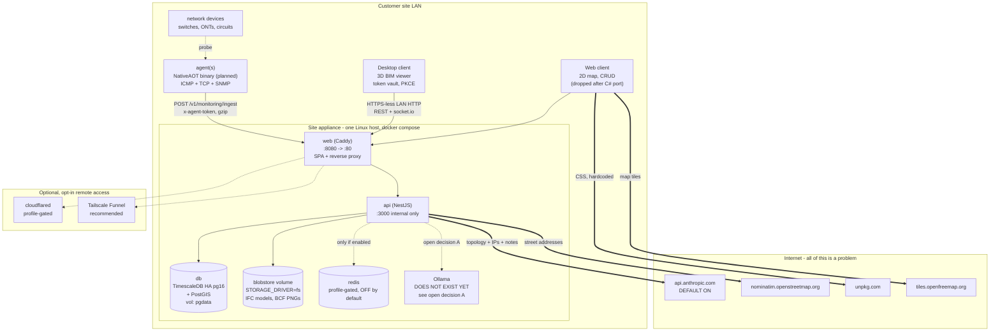
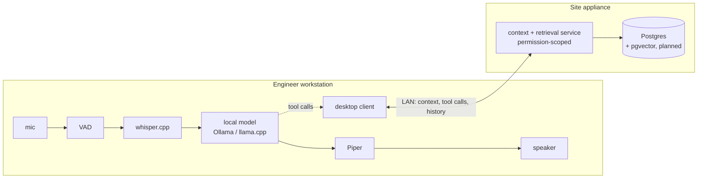

# Systems architecture: hosting, clients, and data flows

**Date:** 2026-07-19
**Status:** map of current reality + open decisions. Not a change proposal.
**Type:** architecture reference
**Related:** [`2026-06-30-local-first-architecture-direction.md`](./2026-06-30-local-first-architecture-direction.md)
(the umbrella premise), [`2026-07-04-appliance-packaging-design.md`](./2026-07-04-appliance-packaging-design.md)
(what ships), [`local-ai-and-voice.md`](./local-ai-and-voice.md) (AI direction),
[`../migration/csharp-migration-decisions.md`](../migration/csharp-migration-decisions.md)
(the port that will target this architecture).

## Purpose

The local-first doc set the premise: the source of truth is a per-site server on
the customer's LAN, and only three things may cross the WAN (off-site access,
encrypted backup, MSP aggregation), each opt-in. This document checks the
implementation against that premise, states where every component is hosted,
what each client needs, and where data actually travels.

Everything below is verified against the working tree unless marked *planned*.

## The premise, tested

**The appliance boots and runs LAN-only today.** Default `docker compose up`
gives three containers (db, api, web), filesystem blob storage, no Redis, no
MinIO, same-origin web that survives DHCP IP changes. That part holds up.

**But the default configuration violates the sovereignty rule in two places,**
and a third is unconditional. See [WAN egress](#wan-egress-the-actual-list).

## Hosting map

### Where each component runs

| Component | Host | Exposure | Notes |
|---|---|---|---|
| `db` | appliance | compose network only, no published port | `timescale/timescaledb-ha:pg16`, vol `pgdata`, limit 1g |
| `api` | appliance | compose network only, reachable via Caddy | limit 1g, `--max-old-space-size=768` |
| `web` (Caddy) | appliance | **the only published port**, `${WEB_PORT:-8080}:80` | proxies `/api/*` and `/socket.io/*` to `api:3000` |
| `redis` | appliance | none | `profiles: ["redis"]`, off by default; in-memory substitute is real and tested |
| blob storage | appliance | none | `STORAGE_DRIVER=fs`, `blobstore` volume. Dev still defaults to `s3`/MinIO |
| `cloudflared` | appliance | outbound only | `profiles: ["tunnel"]`, off by default |
| agent | anywhere on LAN | outbound only to appliance | enrolled via one-time code, credentials at `/etc/nodescope-agent/credentials.json` mode 0600 |
| desktop client | engineer workstation | n/a | Electron today, native after the C# port |
| web client | any LAN browser | n/a | dropped at the end of the C# migration |
| inference (Ollama) | **undecided** | **undecided** | see open decision A |

**TLS is off by default.** `Caddyfile:6` sets `auto_https off`; the LAN default is
plain HTTP with cookie auth, which the appliance design accepts explicitly. The
three documented TLS paths (Tailscale Funnel, Cloudflare Tunnel, Caddy + Let's
Encrypt) all require WAN and a hostname. There is no self-signed option.

## WAN egress: the actual list

Five destinations. Ranked by how badly each contradicts the sovereignty rule.

| # | Destination | Sent by | What leaves | Override | Severity |
|---|---|---|---|---|---|
| 1 | `api.anthropic.com` | API, `claude.adapter.ts:20` | Device names, **IP addresses**, free-text notes, connection graph, fiber runs, ISP circuit IDs, and conversation history. Onboarding also sends home address, network name, and ISP | `AI_PROVIDER=openai-compatible`, but **the default is `claude`** in `docker-compose.prod.yml:126` and in `ai.module.ts:34` | **Critical** |
| 2 | `unpkg.com` | Browser, `MapView.tsx:85` | Request metadata, user IP, on every map mount | **None. Hardcoded `<link>` injection** | High (availability + privacy) |
| 3 | `tiles.openfreemap.org` | Browser, `MapView.tsx:19` | User IP + viewport coordinates, revealing which sites are being inspected | `EXPO_PUBLIC_MAP_TILE_STYLE_URL`, but **not plumbed as a Dockerfile build arg**, and Metro inlines it at bundle time, so the shipped image always bakes the default | High |
| 4 | `nominatim.openstreetmap.org` | API, `nominatim.adapter.ts:33` | User-supplied street addresses | None for the URL; bound unconditionally in `map.module.ts:15` | Medium (fails soft, returns null) |
| 5 | `raw.githubusercontent.com` | Seed/demo scripts only | n/a | Skip the script | Ignorable |

Notably clean: **zero** telemetry, analytics, crash-reporting, or auto-update
SDKs anywhere in the repo. No web fonts. No OAuth providers. The only client-side
CDN load in the entire codebase is #2. That is a good posture, which makes the
five above worth closing rather than living with.

### Remediation cost

- **#1** is the one that matters and is not just an env flip - it depends on open decision A.
- **#2** is a one-line fix: vendor the CSS into the bundle. Also unblocks turning CSP on.
- **#3** needs an `ARG EXPO_PUBLIC_MAP_TILE_STYLE_URL` in `deploy/Dockerfile.web`, plus a decision about what LAN tile source exists at all. A network-ops tool whose map goes blank during a WAN outage has the same problem as a dashboard that goes dark.
- **#4** needs a null/offline geocoding provider bound when offline. It already fails soft, so this is about honesty, not crashes.

## Data flows and volumes

### Agent to appliance (the sizing driver)

Probe cycle 30s, device-list sync 300s, heartbeat every cycle in a `finally` so
liveness is decoupled from ingest success. Batches of 500 items, gzipped above
1 KB, against a 1 MB inflated server body limit.

| Scenario | Per device per day, pre-gzip |
|---|---|
| Reachability only (ICMP/TCP) | ~370 KB to 1.3 MB |
| \+ SNMP scalar | \+ up to 1.7 MB |
| \+ SNMP `interfaceMetrics`, 48-port switch | **~121 MB** |

The 48-port case dominates by two orders of magnitude and is what sizes ingest
and database growth. Requests per agent per day: ~6,048.

The on-disk buffer (`buffer.jsonl`, cap 5000 chunks, FIFO) is unusually careful:
413 splits the batch in half and retries rather than dropping, a single item that
still 413s is dropped as poison so it cannot wedge the queue, and other 4xx are
dropped as permanent while 5xx/429 keep the head. **There is no backoff** - a
failed drain simply waits for the next 30s tick, so a fleet recovering from an
API outage retries in lockstep.

### Desktop client to appliance

- **IFC models always round-trip through the server.** There is no local-file-open path. Import is a DOM file picker to `POST .../model/versions`; render is `GET .../model/active/file` returning an `ArrayBuffer` parsed in a worker.
- **Ceiling 200 MB per model** (`MODEL_MAX_BYTES`), enforced streaming so an oversize upload aborts mid-flight.
- A **keep-last-1** in-memory cache means switching between two buildings re-downloads up to 200 MB each time, and model re-activation deliberately clears the cache. This is the heaviest single LAN flow.
- Auth: PKCE over the system browser to `nodescope://auth/callback`, token encrypted at rest via Electron `safeStorage`, fail-closed if no keyring.
- The main-process IPC surface is 5 handlers and there is **no filesystem bridge** - `contextIsolation` on, `sandbox` on, `nodeIntegration` off.

### Web client to appliance

- Base URL resolves to `window.location.origin`, which is what makes the appliance survive DHCP changes.
- Offline queue covers **device and circuit mutations only**, in `localStorage`, with stable idempotency keys so replay cannot double-insert, 409 treated as terminal, max 5 attempts, drained on socket reconnect.
- **The browser collector is the noisiest client flow:** every 30s per visible tab it runs a download probe plus a **100 KB upload** against `/api/bandwidth/echo`, roughly **576 MB/day per continuously-open tab**, purely to measure the link. Cheap on a LAN, but worth knowing it exists.

### Realtime

3 client-to-server events, ~50 server-to-client. Ping every 25s, server push
scheduler every 30s with org concurrency 4. Redis does four separate jobs here
(backplane, presence leases, per-user metrics rate limiting, cross-replica push
lock), all of which have correct single-node fallbacks. `CLUSTER_MODE=true`
without `REDIS_URL` is fatal at boot, deliberately.

## What the desktop client needs

Collected here because it drives the C# desktop decisions (migration doc #14-17).

| Need | Today | After the port |
|---|---|---|
| Auth | PKCE deep link, session token in OS-encrypted vault | Same flow, ported (migration decision 7) |
| 3D IFC | `web-ifc` WASM + three.js in a worker | xBIM Toolkit, spike required (#16) |
| Map | **Nothing - desktop has no map code today** | Mapsui, spike required (#15). This is net-new surface, not a port |
| Realtime | socket.io | SignalR |
| Blob transfer | up to 200 MB over LAN, 1-entry cache | Same, but a real disk cache is worth considering |
| Voice | **Does not exist.** Zero audio code in `apps/desktop` | whisper.cpp + Piper, planned only |
| Offline | none - desktop assumes the server | Largest net-new effort, still undesigned |

Two things that read as existing but do not: the map (web-only today) and voice
(no `getUserMedia`, no STT/TTS, nothing). Both are net-new builds on the desktop
client, not ports.

## AI: what is built vs. what is designed

**Built:** the provider seam (`complete`/`stream`), both adapters, env-string
selection, a four-provider context chain with permission scoping and token
budgets, Redis conversation storage (24h TTL, last 40 messages), four-tier rate
limiting, socket.io token streaming, and a graceful-degradation fallback that
regex-extracts the network summary back out of the system prompt.

**Not built, despite reading as built:**
- **pgvector / RAG does not exist in any form.** No extension, no table, no embedding code. There is a `RagContextProvider` seam bound to a no-op returning `''`.
- **`isAvailable()` exists but is never called.** `ai.module.ts:34` selects purely on the env string. The docstrings describing availability-aware selection are written in the present tense and are aspirational.
- **`ClaudeAdapter` has no timeout at all**, while the local adapter has three layers of deadline protection. The unbounded one is the default path.
- Voice: nothing.

## Open decisions

## AI architecture: decided 2026-07-19

Two requirements drove this: the assistant must **reason within the network
context**, and it must **hold a two-way voice conversation** with the engineer.

### A. Inference and voice run on the workstation; context and retrieval on the appliance

**Decided.** The desktop client owns the model runtime, the voice loop, and turn
-taking. The API owns context assembly, permission scoping, and (later) RAG
retrieval, and hands the client a grounded context rather than an answer.

**Why the workstation, given "clients are thin":**

1. **Voice is a latency budget and it picks the host.** Natural turn-taking needs
   roughly <500 ms from end-of-speech to first audio. VAD + STT costs ~150-300 ms
   and TTS ~50-100 ms, leaving very little for time-to-first-token. A 7-8B model
   runs ~5-15 tok/s on CPU versus 50-100+ on a GPU, so conversational voice needs
   a GPU wherever it runs.
2. **Once a GPU is mandatory, a shared one is the wrong place for it.** Concurrent
   voice sessions contend on exactly the latency-critical resource. N engineers
   talking means N concurrent generations on one card.
3. **The workstation already has a GPU** - it is running the 3D BIM viewport.
4. **The web client objection is void.** The browser UI is being dropped in the
   C# migration; there will be one native desktop client. The client that would
   lose AI is being deleted.
5. **Off-LAN works**, which appliance-hosting cannot offer.

**This does not violate "clients are thin, not authoritative."** That principle
governs *authority over data*, not where computation happens. The appliance
remains the source of truth; the workstation runs a model over data the user is
already authorized to see. Stating this explicitly because it reads as a
contradiction and is not one.

**The appliance keeps no GPU requirement.** Its minimum stays as-is, which
preserves "runs on any Linux box" and the per-site MSP economics.

### A1. Consequence: the context must become tool-calling, not a prompt dump

Relocating the model does not by itself deliver "reason within the context."
Today the context is a static snapshot: up to 200 devices ordered
`createdAt DESC` (`network-context.repository.ts:22-25`), truncated to 40% of an
8000-token budget (`network-context.provider.ts:7,16`), so roughly 3200 tokens.
For any real network that is an arbitrary slice of the newest records, and a
question about anything outside the cap is unanswerable.

A conversational assistant needs to **query the API mid-turn** rather than be
handed a truncated snapshot up front. Agentic tool use was an optional late phase
in `local-ai-and-voice.md`; it is now load-bearing and sits at Phase 2 there,
which also shifts model selection toward structured-output/tool-use strength
(Qwen2.5) over general reasoning.

Guardrails carry over unchanged from that doc's §8: tool execution behind
explicit allow-lists, retrieved content and device notes treated as untrusted
(prompt-injection surface), and model output never triggering privileged actions
unguarded. Tool calls are permission-scoped server-side exactly as HTTP endpoints
are - the model gets no ambient authority the user lacks.

### B. Claude is dropped entirely

**Decided.** Not retained as an escalation provider.

- `@anthropic-ai/sdk` and `ANTHROPIC_API_KEY` leave the repo and the compose file.
- Egress point #1 closes permanently rather than being one env var away from reopening.
- The two-adapter seam collapses: Ollama, llama.cpp, vLLM, and LM Studio all speak the OpenAI-compatible wire format, so one adapter covers every realistic runtime and `AI_PROVIDER` selection can go with it.
- C# migration decision 9 resolves to plain OpenAI-compatible HTTP. No Anthropic SDK question remains.
- Accepted tradeoff: a local 7-8B model will not match Claude's reasoning. For a bounded, tool-grounded domain with short answers, that is the trade the "Honest tradeoffs" section of `local-ai-and-voice.md` already argued for.

### C. What is the LAN map story?

The desktop client has no map today and Mapsui is a spike. Independently, tiles
come from the WAN. A network tool whose map blanks during an outage fails the
same test as a dashboard that goes dark. Options: bundle an offline tile pack,
run a tile server on the appliance, or accept a degraded no-basemap mode with
device geometry still rendered.

### D. Does the appliance grow a GPU tier?

A1 implies it. That changes the product from "runs on any Linux box" to a
hardware recommendation, and interacts with the MSP model where one appliance
sits per client site.

## Gaps against the local-first doc

Tracking which of its seven required changes actually happened.

| # | Required change | Status |
|---|---|---|
| 1 | Bless on-prem as primary | **Done.** Appliance Phase 1 shipped; `deploy.yml` (DigitalOcean) is dead, `workflow_dispatch` only, targeting infrastructure that was never provisioned |
| 2 | Remove the TimescaleDB hard dependency | **Reversed 2026-07-02** by the appliance doc and listed as a non-goal. Hypertables, `time_bucket`, and the continuous aggregate are all still live. No `date_bin` anywhere |
| 3 | LAN-friendly self-contained services | **Done.** `fs` storage default in prod, Redis genuinely optional with a tested in-memory substitute |
| 4 | MSP central aggregation layer | Not started |
| 5 | Encrypted off-site backup | Not started. `backup.sh` dumps Postgres only - no blobs, no retention, no scheduling, no restore |
| 6 | Out-of-band alerting | Not started |
| 7 | CI on a self-hosted runner | **Regressed.** Runner offline since 2026-07-10; all workflows disabled |

Retention does exist, but only as TimescaleDB background jobs (90d metrics, 365d
status events, 30d device metrics) - which is the coupling that item 2 was meant
to break.

**The largest verification gap:** every workflow that could prove the appliance
boots runs on the offline self-hosted runner, including `publish-images.yml`. No
GHCR image appears to have been published, and `NODESCOPE_VERSION` still defaults
to `latest` rather than a pinned release.
